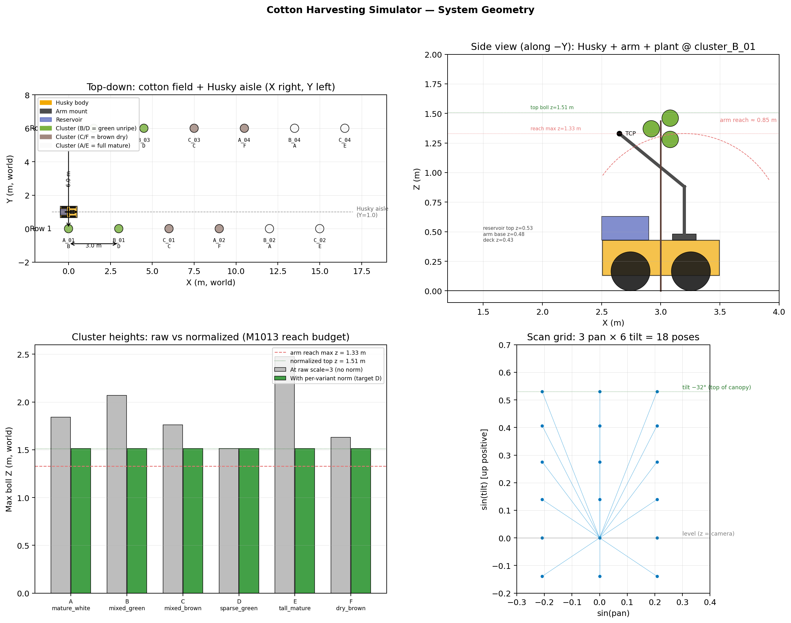
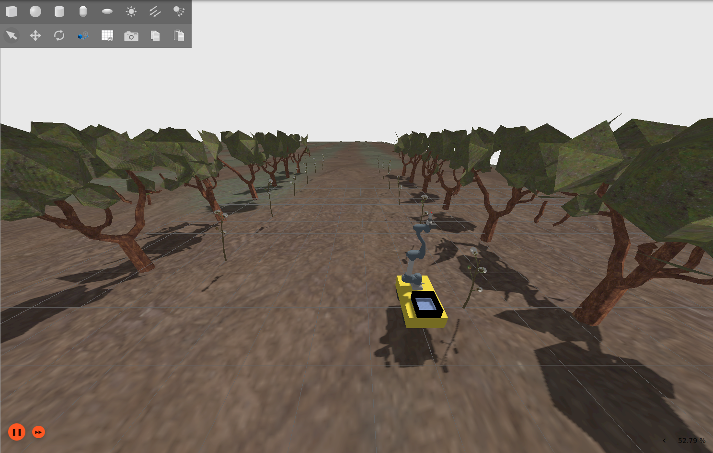
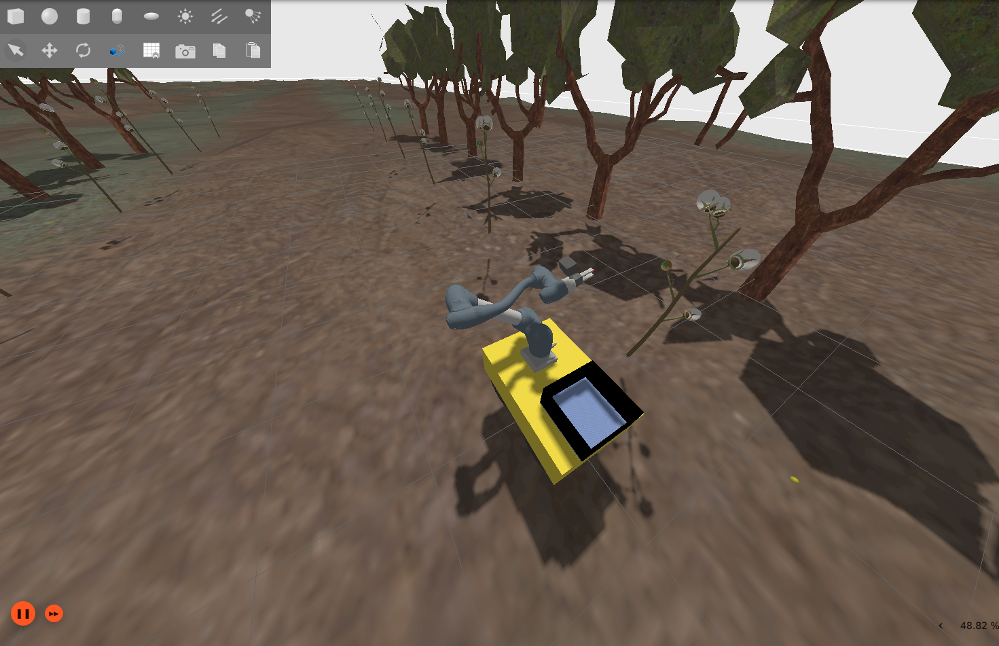
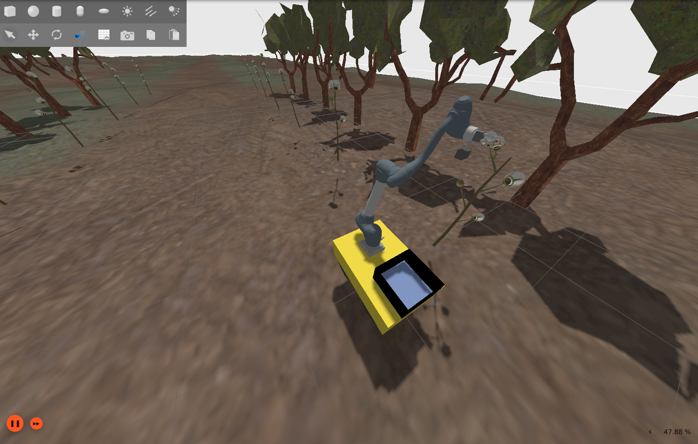
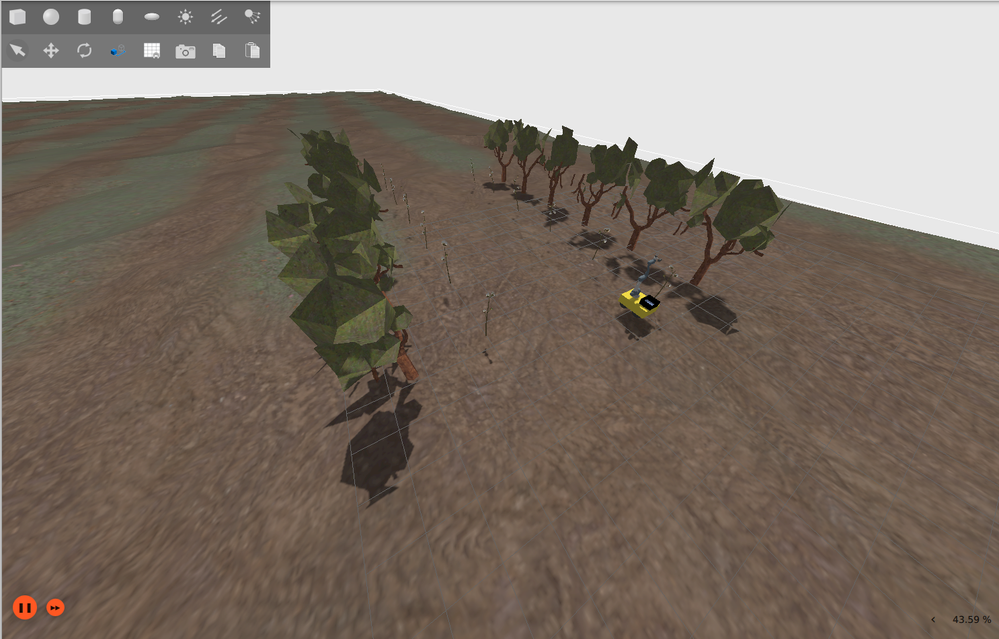
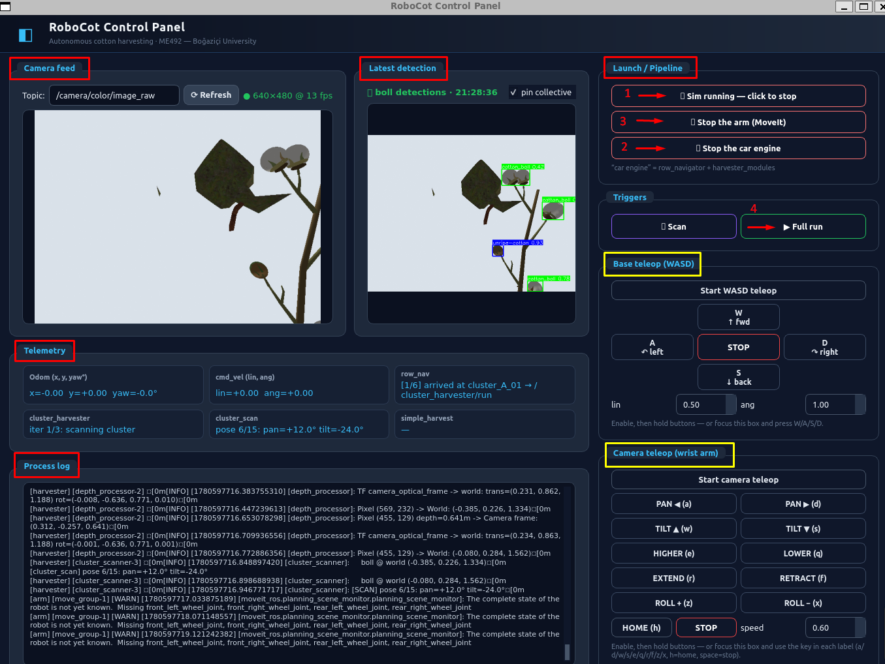

# RoboCot

Autonomous cotton-boll picking demo. A Husky A200 mobile base carries a Doosan M1013 6-DOF arm with a wrist-mounted RGB-D camera and a parallel-jaw gripper into a Gazebo-Fortress cotton orchard, drives between clusters, scans each one with a pan/tilt arm sweep + YOLO11 detection + depth back-projection, picks the bolls it finds, and drops them into a deck-mounted reservoir.

Submitted as the final deliverable for ME492 Mechanical Design — Group 6, Boğaziçi University, 2026. ROS 2 Humble, Gazebo Sim 6 (Ignition Fortress), MoveIt 2, PyQt5 control panel, all running under WSL2 Ubuntu 22.04 on a laptop.


## Where to look for dedicated documents:

- **First-time setup**: [REQUIREMENTS.md](REQUIREMENTS.md) and [scripts/setup.sh](scripts/setup.sh).
- **Repository layout and plug-and-play extension points**: [REPO_STRUCTURE.md](REPO_STRUCTURE.md).
- **Deployment specification + open mechanical / dynamic questions**: [docs/DEPLOYMENT_SPEC.md](docs/DEPLOYMENT_SPEC.md).
- **Architecture diagrams**: [docs/figures/preview_figures.html](docs/figures/preview_figures.html) (open in a browser).
- **Re-train the YOLO detector** (dataset config, train / validate / predict commands, metrics): [yolo_training/README.md](yolo_training/README.md).
- **The lab visit and deployment process that didn't get to run**: [docs/lab_visit_checklist.md](docs/lab_visit_checklist.md), [docs/LAB_GUIDE.md](docs/LAB_GUIDE.md), [docs/INTEGRATION.md](docs/INTEGRATION.md).
- **The original ROS 2 install notes from term one**: [docs/ROS2_starter.md](docs/ROS2_starter.md).
- **Retired code (kept for reference, not built)**: [_legacy/](_legacy/).




<p align="center">
  
  
</p>
<p align="center">
  
  
</p>
<p align="center"><em>Gazebo Ignition Fortress view of the demo running end-to-end.</em></p>

---

## How this project got here

Three pivots, one delivered demo.

**Fall term — rotten fruit on a conveyor belt.** The original scope was a vision-only quality-control demo: a fixed RGB camera looking down on a conveyor, a classical CV detector flagging visually damaged fruit. No manipulation. We did the literature review, decision matrices, and PDS around that brief.

**Mid-fall pivot — strawberry picking with a Braccio.** The conveyor scope was too narrow for a Mechanical Design capstone, so we widened it to selective harvesting. The Arduino Braccio++ 6-DOF arm was a budget-friendly fit; strawberries were the test crop. We sketched the kinematic envelope, did the gripper / camera placement matrices, and started a Gazebo build around the Braccio URDF.

**Spring — cotton, still with a Braccio.** Strawberry harvest cycles are short and the test scene is hard to build cheaply at lab scale, so we switched the crop to cotton. The Braccio integration carried over: same URDF, same eye-in-hand camera, same vision pipeline. We trained a YOLO11s detector on a Roboflow cotton dataset (375 augmented images, mAP@50–95 ≈ 0.60, 95% boll accuracy in controlled lighting). The vision-to-3D pipeline (YOLO → depth back-project via K matrix → world-space dedup → complete-linkage cluster) reached ~1.2 cm mean 3D error against ground truth in simulation.

**Late spring — switching the arm.** The university wouldn't fund a Braccio purchase. The Kandilli campus lab had a Doosan M1013 + Robotiq Hand-E + Jetson Xavier setup ([ROBOCOB platform](docs/ROBOCOB_ANALYSIS.md), originally a mobile-base + ROS 1 stack) sitting unused. We dropped the Braccio URDF, integrated the M1013 mesh + kinematics, kept everything above the URDF layer (orchestrator, detector, depth processor) untouched. The ROS 2 ecosystem paid off here — only the URDF and the joint names changed.

**F1.4 — adding the Husky.** Once we had the arm working, we composed it onto a Husky A200 platform with a deck-mounted reservoir, swapped MoveIt's "fixed to world" mode for the DiffDrive plugin, and built a per-cluster scout-and-pick loop (`row_navigator` drives the base aisle-by-aisle, `cluster_harvester` does the scan/match/pick batch at each stop). That's what runs today.

**The deployment that didn't happen.** With the Doosan now in our URDF and a Dockerfile targeting the Xavier's JetPack 5 / L4T r35.4.1 (see [Dockerfile](Dockerfile) and [scripts/xavier_deploy.sh](scripts/xavier_deploy.sh)), the plan was a lab visit to run our stack on the real arm. We wrote the lab bring-up checklist ([docs/lab_visit_checklist.md](docs/lab_visit_checklist.md)), the deployment guide ([docs/LAB_GUIDE.md](docs/LAB_GUIDE.md)), and the lab-side Xavier installer. The Doosan controller threw a hardware fault on the day, and the lab couldn't fix it in time. The deployment never ran. Everything that was prepared still lives in this repo as a future-work hand-off.

So what is in this repo is the full Husky + M1013 + Hand-E pipeline running end-to-end in Gazebo, with the deployment path documented and dockerised but unexecuted on real hardware.
---
## System at a glance

The system layers cleanly into four concerns:

```
operator       ── PyQt5 control panel (sim launcher · WASD/arm teleop · live telemetry)
   │
compute        ── orchestrator pipeline (row_navigator · cluster_harvester ·
                  cluster_scanner · simple_cluster_harvester · arm_commander ·
                  real_yolo_detector · depth_processor · gripper_controller)
                  on ROS 2 Humble · MoveIt 2 · ros2_control
   │
hardware iface ── Sim:   Gazebo Fortress (DiffDrive, RGB-D sensor, gz_ros2_control)
                  Real:  doosan-robot2 (TCP 192.168.3.5:12345) · Hand-E Modbus RTU ·
                         RealSense / ZED · Husky base driver
   │
physical       ── Husky A200 · Doosan M1013 · Hand-E gripper · wrist RGB-D camera ·
                  reservoir bin · cotton orchard
```

Full diagram: [docs/figures/robocot_system_architecture.png](docs/figures/robocot_system_architecture.png).
Inner ROS-side wiring (per-service edges): [docs/figures/figure_software_architecture.svg](docs/figures/figure_software_architecture.svg).

The orchestrator is **layered, not a state machine**. Each layer exposes one `std_srvs/Trigger` service to the layer above:

| Layer | Node | What it does | Service exposed |
|---|---|---|---|
| 3 | `row_navigator` | drive Husky to each scout pose · recalibrate world↔odom from Gazebo truth · call cluster harvester | `/row_nav/run` |
| 2 | `cluster_harvester` | scan → match detections to YAML boll ids → sort by reach → pick batch → re-scan until empty | `/cluster_harvester/run` |
| 1 | `cluster_scanner` | 15-pose pan/tilt sweep · per-pose `/yolo/detect` + `/depth_processor/pixel_to_3d` · dedup in 3D · gap-rule cluster bbox | `/cluster_scan/run` |
| 1 | `simple_cluster_harvester` | per-boll pick: go-to-pose · mock close · carry thread · reservoir 3-stage drop · teleport scatter | `/simple_harvest/start` |
| 0 | `arm_commander` | IK (KDL multi-seed) + direct JointTrajectory publish · MoveIt fallback | `/go_to_pose` `/go_to_reservoir` `/go_to_named` |
| 0 | `gripper_controller` | open/close + `/joint_states` settle | `/gripper/open` `/gripper/close` |
| 0 | `real_yolo_detector` | YOLO11 inference on `/camera/color/image_raw` | `/yolo/detect{,_clusters}` |
| 0 | `depth_processor` | 5×5 windowed median depth + K back-project + TF to world | `/depth_processor/pixel_to_3d` |

Repo layout, plug-and-play extension points, and the `_legacy/` retirement notes: [REPO_STRUCTURE.md](REPO_STRUCTURE.md).

---

## Running it

Tested host: Windows 11 + WSL2 (Ubuntu 22.04), Intel i5-11400H, 16 GiB RAM, GTX 1650.

```bash
# one-shot: ROS 2 Humble apt + uv + Python deps + colcon build + ~/.bashrc hooks
bash src/scripts/setup.sh

# verify the stack
bash src/scripts/verify_env.sh

# bring it up — one button per row in the control panel
ros2 run orchestrator control_panel

# or, manually, four terminals:
ros2 launch robot_arm husky_orchard_demo.launch.py
ros2 launch robot_arm_moveit_config moveit.launch.py
ros2 launch orchestrator harvester_modules.launch.py
ros2 run    orchestrator row_navigator
ros2 service call /row_nav/run std_srvs/srv/Trigger '{}'
```

Hardware / software requirements, version pins, and the uv-managed Python deps file: [REQUIREMENTS.md](REQUIREMENTS.md) + [pyproject.toml](pyproject.toml).

---

## Control panel

The PyQt5 app is the recommended bring-up surface — one window auto-launches the sim, holds the three launchers behind named buttons, gives you WASD base teleop and arm teleop with on-screen pads + keybinds, and shows the live RGB feed next to the latest annotated detection PNG. Telemetry tiles tail the status topics from each pipeline layer.



It does no real work itself — every button maps to a `ros2 launch` subprocess or a `std_srvs/Trigger` service call. If a process dies, you can restart it from the same button. The "start the car engine" button is the one-click pipeline bring-up (`row_navigator` + `harvester_modules.launch.py`).

---

## Pipeline notes & known limitations

Things worth flagging if you're reading the code or planning to extend it.

### Motion planning is a hybrid, and that's load-bearing

MoveIt 2 (OMPL RRTstar) is in the loop for big moves where collision avoidance matters — the initial HOME pose, the first joint-1 rotation during `/go_to_reservoir`. Everything else (the scanner's per-pose pan/tilt, the per-boll go-to-pose with approach orientation, the final elbow unfold into the reservoir hover) bypasses MoveIt and publishes JointTrajectory directly to `/arm_controller/joint_trajectory`.

The reason is reliability, not speed. MoveIt's `planning_scene_monitor` waits for the complete robot state before it'll plan; the DiffDrive plugin never publishes `/joint_states` for the four wheel joints, so the planning scene stays "incomplete" forever and re-uses stale joint positions across calls. Trajectories planned from a stale start state get rejected by the controller with `start_tolerance > 0.5 rad`. Direct trajectory publish skips that whole machinery. The cost is no collision check on the bypassed segments.

The IK side (`arm_commander.compute_ik_multi_seed`) tries HOME and CURRENT seeds and picks the lower-cost solution. This avoided OMPL randomly returning kinematically valid but visually unreasonable wrist configurations for the same target.

`/go_to_reservoir` deserves a callout — it's a hand-tuned **three-stage heuristic** (HOME → `joint1 = ±π` base rotation → `joint3` elbow unfold) rather than a single IK solve. The bin sits behind the arm mount on the deck, and the wrist has to clear the canopy on the way back. Single-shot IK kept producing solutions that swept the gripper through the plants or the deck. The heuristic is robust enough for the demo but is the most likely component to break if you change the platform geometry.

### Collision objects are intentionally empty

`environment_config.yaml` ships `collision_objects: {}` and `landmark_publisher.py` is installed but unused. The reservoir bin's URDF has no floor collision (visual only). The cotton branch SDFs do have stem collisions, but the bolls themselves are visual-only and the floor under the canopy is absent.

This was deliberate. With collision enabled, the arm couldn't path through the dense canopy mesh and the reservoir mouth at the same time. For the sim demo, collisions are off; the carry thread + teleport pattern keeps the bolls glued to TCP regardless of what the arm passes through. **For real-hardware deployment this has to be re-enabled** — the cotton branches and the reservoir bin both need MoveIt collision shapes, the URDF needs floor + deck collision, and the path planner has to handle the canopy density. This is the single largest gap between the sim demo and a deployable system.

### The "Hand-E" in the URDF is a from-scratch box gripper

The actual Robotiq Hand-E URDF (with mesh, `<mimic>` joint, parallel finger physics) was integrated initially but kept failing in sim: the prismatic finger's friction model couldn't overcome the closing force on the way back up out of the plant, so the gripper would un-grip itself in transit. We replaced it with a [minimal box-and-pad design](robot_arm/urdf/m1013_robocot.urdf.xacro#L268) — a 60×40×50 mm palm, one prismatic finger sliding along +X between OPEN (−20 mm) and CLOSED (+10 mm), a fixed pad as the counter-finger.

That design works because the pick is mock-coupled anyway — the boll teleports onto the TCP, the gripper just animates. The Hand-E friction issue has since been resolved at the URDF level (damping + gravity-disable on the fingers); if you want to re-introduce the real Hand-E, the joint name (`hande_left_finger_joint`) and the controller config are already wired for it. Replace the box-and-pad block with the original mesh + mimic stack and re-enable the right finger's prismatic axis.

### Scan strategy is statik scan-then-act, not closed-loop visual servoing

The demo runs a fixed 15-pose pan/tilt sweep (3 pan × 5 tilt), accumulates raw 3D detections across all poses, deduplicates in world space, then picks each boll in order. There's no per-pose feedback loop, no IBVS-style refinement at pick time.

A more dynamic alternative would be: scan once, get a coarse cluster bbox, drive the arm to a closer viewing pose, re-scan, refine the boll position, then pick. Or full visual servoing — keep the camera on the target during approach and correct from pixel error every frame. We deliberately did neither — the static "find all → go to each → verify at the end" loop was simpler to debug, more predictable timing-wise, and gave us 1–2 cm 3D positioning error which was already inside the gripper's tolerance for the mock pick. Closed-loop pre-grasp refinement is on the future-work list ([3.6](#future-work)) if the sim-to-real transfer ever needs sub-cm precision.

### The 6-DOF arm is not load-bearing

The pipeline doesn't actually require six joints. It needs base rotation (joint 1), shoulder + elbow tilt (joints 2 + 3) for the scan tilt, and one wrist joint (joint 5) for the camera pitch. The other two wrist joints (4, 6) stay at zero. We chose the Doosan M1013 because that's what the Kandilli lab had — the design itself could be done on a well-tuned 4-DOF arm with longer reach (the Braccio's 520 mm horizontal envelope was tight for the cotton row geometry, but a longer-reach 4-DOF would fit fine).

### Reach budget shapes the world

The M1013 has 1.3 m reach. The Husky deck puts the arm base at z = 0.48 m, so the maximum reachable height is ~1.78 m. The cotton branch variants in the world have top bolls up to z = 2.5 m at raw asset scale — so we apply a per-variant normalisation in `generate_cotton_demo.py` that compresses each branch's vertical extent until its top boll sits at z = 1.51 m, leaving a small margin under the reach max. See [docs/sketches/variant_heights.png](docs/sketches/variant_heights.png) for the raw-vs-normalised heights. This is a sim-only artifact; in a real orchard, the platform height or arm-mount riser would do this geometry budget.

### Carry threads are sim-only

`simple_cluster_harvester` runs two background threads that call Gazebo's `set_pose` service at 10 Hz (per-boll carry, glues boll to TCP) and 2 Hz (reservoir carry, glues already-dropped bolls to the reservoir frame as the Husky drives). These exist because we can't actually grasp anything — the mock pick is a teleport. On real hardware, both threads disappear and the grasp is whatever the Hand-E does with its real force feedback.

---

## Detection

### YOLO11 (default)

`real_yolo_detector` runs Ultralytics YOLO11n with `best.pt` (Roboflow cotton-boll-and-cluster v5, classes: `cotton_boll`, `unripe-cotton`). The sim launch override sets the confidence threshold to 0.30 to recover marginal detections at scan range; the model author's recommended baseline for general use is 0.54. Reads `/camera/color/image_raw` continuously, runs inference on every `/yolo/detect` call, returns a list of `BoundingBox(u_min, v_min, u_max, v_max, confidence, label)`. Annotated frames are saved to `yolo_output/detect_*.png` and `yolo_output/clusters_*.png`.

The full training package ships in [yolo_training/](yolo_training/) — dataset config, training entrypoint, validation script, metrics CSV + curves, and the 80-epoch run that produced `best.pt`. Test-split metrics on YOLO_2026-05-30 (train 603 / val 57 / test 29):

| class | precision | recall | mAP50 | mAP50-95 |
|---|---:|---:|---:|---:|
| all           | 0.956 | 0.971 | 0.972 | 0.806 |
| cotton_boll   | 0.913 | 0.946 | 0.950 | 0.811 |
| unripe-cotton | 1.000 | 0.995 | 0.995 | 0.801 |

Downstream consumers treat `cotton_boll` as the pickable class and ignore `unripe-cotton` (the unripe class is detected mainly so it stops contaminating the ripe class's predictions).

### Classical CV alternative (`cv_boll_detector`, plug-and-play)

`real_yolo_detector` advertises a service contract; anything that advertises the same `/yolo/detect{,_clusters}` services with the same `harvester_interfaces/srv/YoloDetect` schema slots in. `cv_boll_detector` is the GPU-free alternative we kept maintained for that reason.

It's not a HSV-thresholding baseline — that was tried during ME429 and rejected (the gripper's own white parts triggered ~50% false positives on raw color thresholding alone). The current `cv_boll_detector` is a **four-stage physics-based filter** that exploits the fact that we know the boll geometry (sphere of radius `r_world = 0.035 m`):

1. **Coarse mask** — depth ∈ [0.20, 3.00] m kills sky, NaN, and far surfaces; a color mask (brightness ≥ 90, chroma ≤ 25) drops saturated canopy. The color floor is tuned to the URDF boll material (`rgba(0.95, 0.95, 0.9)` — desaturated near-white). Morphological open + close.
2. **Shape pre-filter** — `cv2.SimpleBlobDetector` finds light, sphere-like blobs at multiple internal thresholds. Cheap area + circularity sanity check; skips noise before the expensive per-candidate depth pass.
3. **Physics invariants per candidate** (the real discriminators):
   - **A — radius vs depth**: at depth `d`, the detected blob's pixel radius must equal `fx · r_world / d` within ±30%. A sphere of known size at known depth has only one valid screen footprint.
   - **B — depth std inside silhouette**: must lie in `[0.15·r_world, 3.0·r_world]` ≈ `[5 mm, 105 mm]`. Below 5 mm = flat (ground patch, sky leak); above 105 mm = multi-object blob or branch/canopy edge.
   - **C — in-reach check**: the 3D point in `base_0` frame must be ≤ 1.5 m from the arm base. Out-of-reach detections don't matter.
4. **Pixel floor** — minimum pixel radius 14 px. Below this, the physics filters lose discrimination power. Sets an effective max depth ≈ 0.69 m (sufficient for the M1013's pre-grasp envelope).

The honest comparison:

| | YOLO11 | `cv_boll_detector` |
|---|---|---|
| Compute | GPU strongly preferred (≥4 GiB VRAM); CPU works at ~10× slower | CPU only, ~50 ms per detection call |
| Training | Roboflow dataset + augment + YOLO11s fine-tune | None — physics + camera intrinsics |
| Cross-environment robustness | Generalises reasonably under lighting / background variation | Tuned for sim boll material; real-cotton textures would break the chroma floor and the depth-std factor |
| Class discrimination | Yes (`cotton_boll` vs `unripe-cotton`) | No — geometry can't tell ripe from unripe |
| Partial occlusion | Handles it (learned feature has shape priors) | Breaks the circularity check; truncated blobs get rejected |
| Reach window | Whatever the camera resolves | Hard-capped by the pixel floor (~0.7 m max depth) |
| Failure mode | Confidence collapses on out-of-distribution scenes | Filters get stricter and miss real bolls; or looser and admit ground/canopy noise |

`cv_boll_detector` is good enough for the sim demo if you want to run without a GPU — swap it into `harvester_modules.launch.py` by replacing the `real_yolo_detector` Node block with the `cv_boll_detector` executable. The downstream pipeline is identical. It's also our fallback path for the "no-GPU deploy" scenario in the future work list below.

### Mock detector

`mock_yolo_detector` exists for sanity-checking the TF / depth path without YOLO. It projects YAML ground-truth boll positions to pixel space using the live camera pose, returns those as bounding boxes. Useful when something's wrong in the pipeline and you need to know whether the detector or the geometry is at fault.

---

## Future work

Roughly in priority order. The first two are the practical blockers for taking this off a laptop and onto real hardware.

1. **Docker deployment on the real Doosan.** The Dockerfile ([Dockerfile](Dockerfile)) targets JetPack 5 / L4T r35.4.1 on the lab's Jetson Xavier, with `--runtime nvidia --network host --privileged -v /dev:/dev` for GPU access, Doosan TCP at 192.168.3.5:12345, and USB pass-through for the Hand-E RS485 and the camera. The bring-up script ([scripts/xavier_deploy.sh](scripts/xavier_deploy.sh)) handles `check / verify / build / run / test` modes. The lab visit checklist ([docs/lab_visit_checklist.md](docs/lab_visit_checklist.md)) documents the on-site bring-up. This is ready to run as soon as the lab's robot is back in service.
2. **Plant-stem and reservoir collisions in MoveIt.** Currently disabled because the canopy mesh density made path planning intractable. A proper deployment needs the cotton branch stems registered as `CollisionObject`s in `/planning_scene`, the reservoir bin walls as a `BoxStack`, and an ACM that lets the gripper finger pass through the boll-radius region without flagging.
3. **Hand-E gripper restoration.** The original Robotiq Hand-E URDF (mesh + `<mimic>` joint + bidirectional fingers) was disabled because of a sim physics issue (closing-force friction wouldn't hold during transit). The underlying URDF fix (damping + gravity-disable) has been applied to the simplified box gripper and would carry over. Swap the box-and-pad block in [m1013_robocot.urdf.xacro:268](robot_arm/urdf/m1013_robocot.urdf.xacro#L268) for the original mesh + mimic stack. The controller config (`hande_left_finger_joint`) is already in place.
4. **GPU-free deployment via the classical CV path.** Drop the YOLO dependency entirely by running `cv_boll_detector` instead of `real_yolo_detector` in production. The detector is already plug-and-play (same `/yolo/detect{,_clusters}` services); the catch is that its color + depth-std thresholds are tuned to the sim's URDF boll material. Real-cotton tuning is a small but real effort. Removes the GPU + ultralytics + torch dependency stack — the deploy container shrinks from ~5 GB to ~500 MB and works on a Raspberry Pi 5 / Orin Nano without CUDA.
5. **Closed-loop pre-grasp refinement.** The current scan is static (sweep → 3D → go → verify at end). A short visual-servoing loop at pre-grasp pose — driving the arm to centre the boll bbox in the camera frame before closing — would tighten the pick to sub-cm and recover from depth-estimation noise on partially-occluded bolls. The `camera_focus` node from the earlier state-machine pipeline ([_legacy/orchestrator_old/camera_focus.py](_legacy/orchestrator_old/camera_focus.py)) was a starting point on this.
6. **Sim-to-real characterisation.** The sim's depth sensor is noise-free and the K matrix is fixed; real depth (RealSense / ZED) has range-dependent noise, multipath artefacts, and per-frame calibration drift. Need a measurement campaign on the real camera, then re-tune the depth-window median + the `radius_tol` / `depth_std_factor` in `cv_boll_detector`.
7. **Multi-row navigation.** `row_navigator` currently handles one aisle of clusters along world +X with a single Y-snap recalibration step. Multi-row orchard navigation needs row transitions (end-of-row turn, reverse drive down the next aisle), an obstacle layer for inter-row plant overhang, and a finer odometry source (the DiffDrive skid-steer drifts 10–40 cm laterally per metre of travel; we currently snap back to row line each cluster).
8. **Cycle time optimisation.** ~75 s per boll, ~5–8 min per cluster in current sim. Dominated by the `/go_to_reservoir` 3-stage heuristic and the 15-pose scan sweep. A reduced scan grid (3×3 instead of 3×5) plus a single-stage IK reservoir reach (gated on real-hardware collision data) would roughly halve this. The cluster_scanner pose grid is parameterised — `pan_angles_deg` and `tilt_angles_deg` on `/cluster_scanner` — so the experiment is one ROS param away.

## Credits
ME492 Group 6 — Ayhan Oruç, Deniz Gerdan, Mehmet Baran Erden. Boğaziçi University, Department of Mechanical Engineering, spring 2026. Advisors: Prof. Nuri Bülent Ersoy, Prof. Sinan Öncü, Prof. Hasan Bedir.